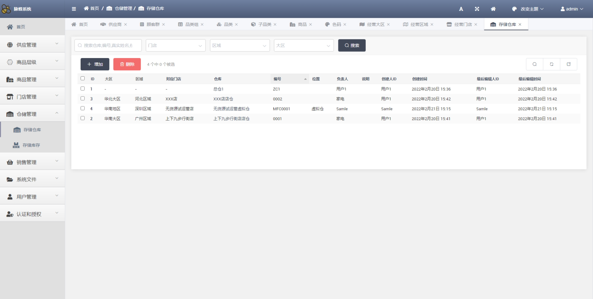

## MaiFeng

 

---

&nbsp;&nbsp;&nbsp;&nbsp;&nbsp;&nbsp;&nbsp;&nbsp;
Maifeng is a commodity inventory control ERP system that uses Python language Django framework to develop backend, Vue to develop front-end, and Flutter to develop mobile terminal. Used to manage the goods in and out of the warehouse, inventory, etc. Currently under development, based on the original Admin background transformation to achieve basic front-end data management functions; The mobile terminal is developed using Flutter, and some pages have been completed. Additional functions will be followed up as appropriate. 

### 项目地址
+ [Backend ：https://github.com/MarkSamle/MaiFeng/tree/main/maifeng](https://github.com/MarkSamle/MaiFeng/tree/main/maifeng)
+ [Mobile ：https://github.com/MarkSamle/MaiFeng/tree/main/maifeng_app](https://github.com/MarkSamle/MaiFeng/tree/main/maifeng_app)
+ [Demo address](http://106.13.1.2:82/)：  Has completed user rights, commodity information management, supplier information management module.    Test Account 1：`user001` password：`admin123..`； Test Account 2：`user002` password：`admin123..`
+ [ Android installation package ： mf-app.apk](./mf-app.apk)

### 模块设计
 + basic data 
	 + commodity management 
		 + commodity hierarchy 
		 + commodity data 
	 + Store Management 
		 + regional data 
		 + Store Data 
		 + geographic data 
	 + Warehouse management 
		 + warehouse data 
		 + inventory data 
	 + Supply management 
		 + Supplier Data 
	 + User management 
		 + user data 
		 + permission data 
 + business data 
	 + Order Management 
		 + Order Data 
	 + Data statistics [re-develop after having operational data] 
		 + Commodity sales data [cross sub-category, category, customer group, store, region, region statistics] 
		 + Commodity inventory data [cross sub-category, category, customer group, store, region, region statistics] 
	 + Data analysis [re-develop after having operational data] 
		 + sales forecast 
		 + inventory planning 
		 + fashion trend 
		 + Hot product selection 

### 功能设计
+ 基础数据维护功能
	+ Django后台
	+ Web操作界面
+ 移动端操作功能
	+ 扫码
		+ 商品信息【商品查询：基础信息、供应信息、销售情况、库存结余……】
		+ 到货入库【库存增改：对应用户选择仓库、库存数据快速创建、修改】
		+ 挑拨出库【库存删改：对应用户选择仓库、库存数据快速删除、修改】
		+ 销售出库【库存删改、订单创建：根据系统优惠信息创建订单，删改库存】

+ Basic data maintenance function
    + Django Backstage
    + Web operation interface
+ mobile operation function
    + Scan code
        + Product Information [Product Query: Basic Information, Supply Information, Sales Status, Inventory Balance…]
        + Arrival Receipt [Inventory Add/Modify: corresponding to the warehouse selected by the user, quick creation and modification of inventory data]
        + Issue [Inventory Delete/Modify: corresponding to the warehouse selected by the user, quickly delete/modify the inventory data]
        + Sales Issue [Delete Inventory, Create Order: Create an order according to the system discount information, and delete the inventory] 

### 使用说明
+ Try account login, or leave a message to help register an account, or try a test account to create a new account 
+ Create a group!!!  The viewable data has been bound to the group. You can view the corresponding data only after creating the group 
+ Add a group. Users can group users in the `User` module of `Authentication and Authorization` 
+ Manage user information. You can manage user information in the `User Management` module 
+ Maintain data: supplier → customer group → category group → category → sub-category → single product → color model 

### 权限设置
+ Manage permissions by grouping, which limits what users can view 
+ Data isolation is performed by grouping. Specify the visible grouping of each piece of data. If not specified, all the groups you belong to can be seen by default. 
+ Users can create subordinate users. When creating, limit the user permissions for easy management. At the same time, specify user groups 

### WEB页面展示

|||||
|---|---|---|---|
 |Log in| Home Page| system user| group permission| 
|||||
 |User Information| User profile picture| System Picture| system file| 
|||||
|customer group| Category Group| Category| subcategory| 
|||||
|Region| Region| store| Warehouse| 
|||||
|Supplier| Single product| SKU| Inventory| 
|||||
|order| detail|---|---| 
|||---|---|

### Flutter页面展示

