

## 脉蜂

 

---

&nbsp;&nbsp;&nbsp;&nbsp;&nbsp;&nbsp;&nbsp;&nbsp;
脉蜂是一款使用Python语言Django框架开发后端、使用Vue开发前端、使用Flutter开发移动端的商品进销存管控ERP系统。用于管理商品的进出库、进销存等。目前正在开发中，基于原有的Admin后台进行改造实现基础前端数据管理功能；移动端使用Flutter进行开发，目前已经完成部分页面。更多功能会在后续酌情跟进。

### 项目地址
+ [后端 https://github.com/MarkSamle/MaiFeng/tree/main/maifeng](https://github.com/MarkSamle/MaiFeng/tree/main/maifeng)
+ [移动端 https://github.com/MarkSamle/MaiFeng/tree/main/maifeng_app](https://github.com/MarkSamle/MaiFeng/tree/main/maifeng_app)
+ [演示地址](http://106.13.1.2:82/)、已完成用户权限，商品信息管理，供应商信息管理等模块。 提供测试账号1：`user001` 密码：`admin123..`；测试账号2：`user002` 密码：`admin123..`
+ [安卓安装包 mf-app.apk](./mf-app.apk)

### 模块设计
+ 基础数据
	+ 商品管理
		+ 商品层级
		+ 商品数据
	+ 门店管理
		+ 区域数据
		+ 门店数据
		+ 地理数据
	+ 仓储管理
		+ 仓库数据
		+ 库存数据
	+ 供应管理
		+ 供应商数据
	+ 用户管理
		+ 用户数据
		+ 权限数据
+ 业务数据
	+ 订单管理
		+ 订单数据
	+ 数据统计【有运营数据后再开发】
		+ 商品销售数据【交叉子品类、品类、顾客群、门店、区域、大区统计】
		+ 商品库存数据【交叉子品类、品类、顾客群、门店、区域、大区统计】
	+ 数据分析【有运营数据后再开发】
		+ 销售预测
		+ 库存计划
		+ 流行趋势
		+ 爆品甄选

### 功能设计
+ 基础数据维护功能
	+ Django后台
	+ Web操作界面
+ 移动端操作功能
	+ 扫码
		+ 商品信息【商品查询：基础信息、供应信息、销售情况、库存结余……】
		+ 到货入库【库存增改：对应用户选择仓库、库存数据快速创建、修改】
		+ 挑拨出库【库存删改：对应用户选择仓库、库存数据快速删除、修改】
		+ 销售出库【库存删改、订单创建：根据系统优惠信息创建订单，删改库存】

### 使用说明
+ 试用账号登录，或留言协助注册账号、或试用测试账号创建新账号
+ 创建分组！！！用户可查看数据已经跟分组绑定，只有创建分组才能查看对应数据
+ 加入分组，用户在`认证和授权`的`用户`模块中可以给用户进行分组
+ 管理用户信息，在`用户管理`模块中可以管理用户信息
+ 维护数据：供应商→顾客群→品类组→品类→子品类→单品→色款

### 权限设置
+ 通过分组管理权限，分组中限制用户可以查看的内容
+ 通过分组进行数据隔离，指定每条数据的可见分组，如不进行指定，则默认自己所在的所有组都可以看到
+ 用户可以创建下级用户，创建时限定用户权限方便管理，同时应指定用户分组

### WEB页面展示

|||||
|---|---|---|---|
|后台登录|后台首页|系统用户|分组权限|
|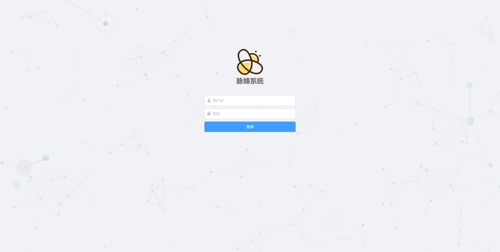||||
|用户信息|用户头像|系统图片|系统文件|
||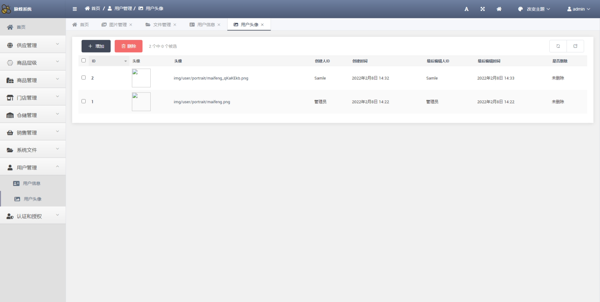|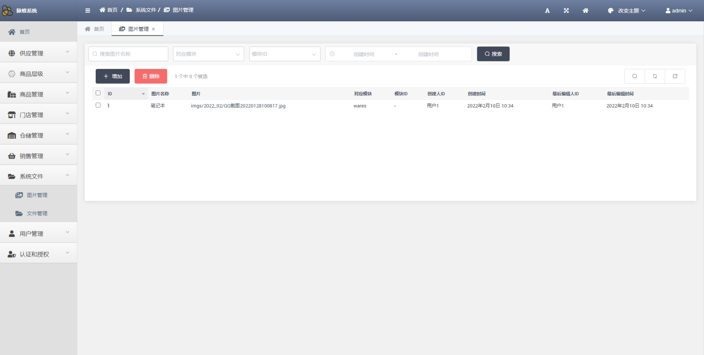|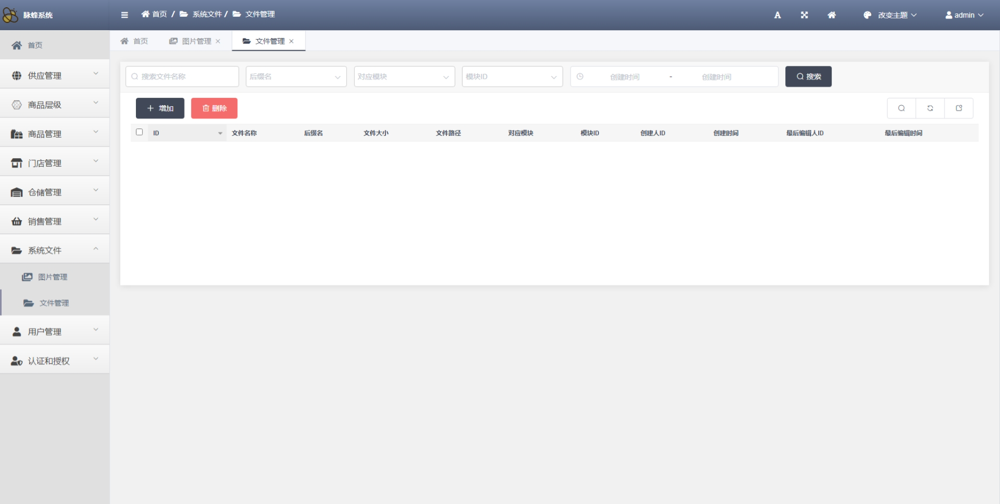|
|顾客群|品类组|品类|子品类|
|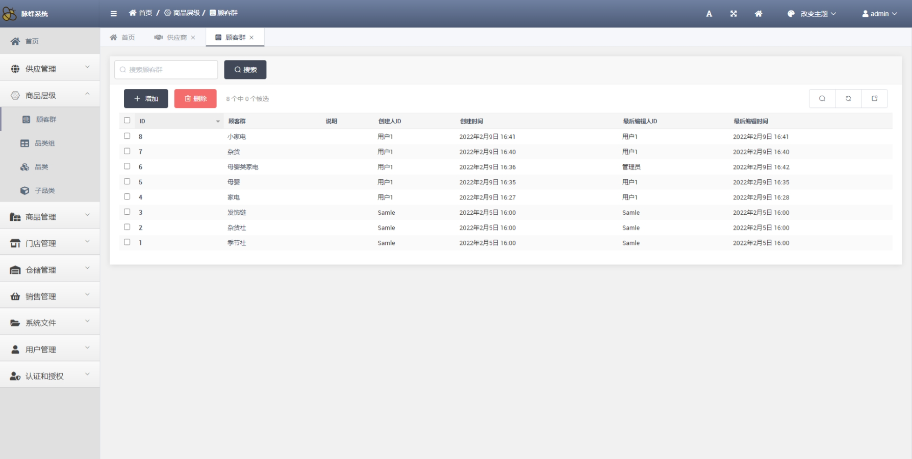|||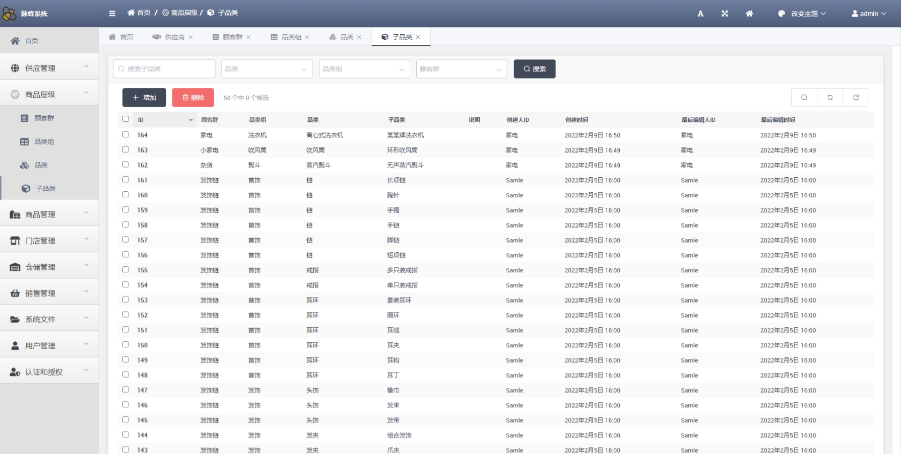|
|大区|区域|门店|仓库|
|||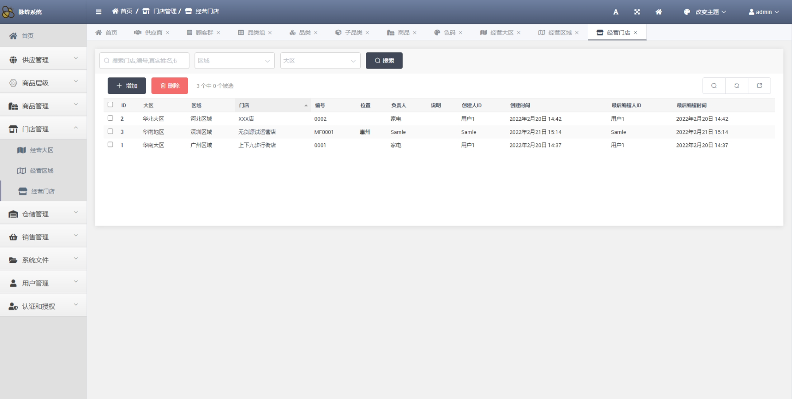||
|供应商|单品|SKU|库存|
|||||
|订单|明细|---|---|
||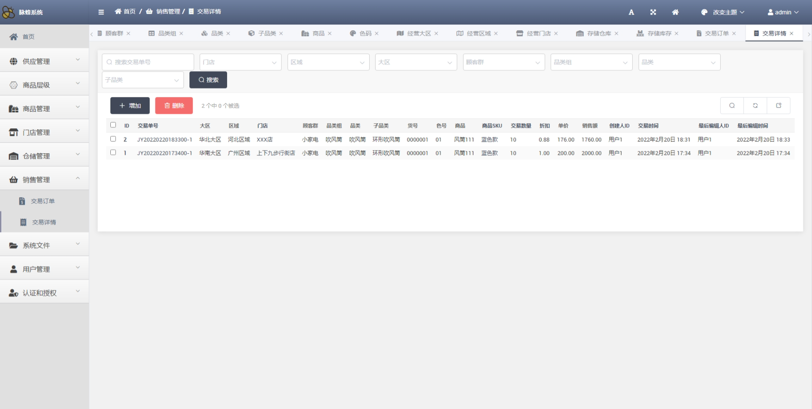|---|---|

### Flutter页面展示

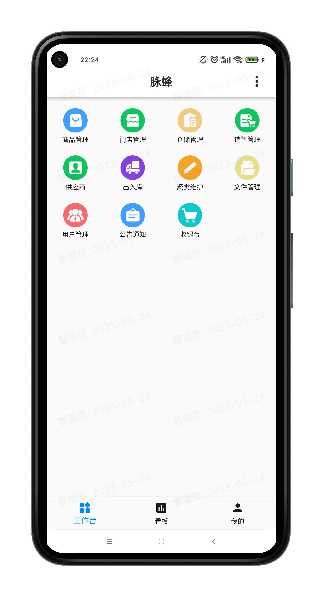

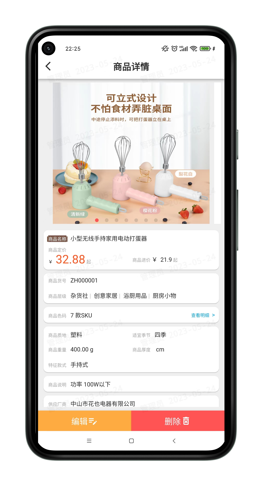

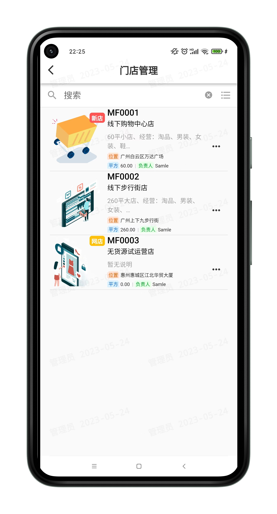

